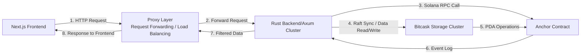

# Aero-KV: Off-Chain Verifiable Key-Value Storage Infrastructure for Solana
> An on-chain and off-chain KV storage middleware based on Solana smart contracts + Raft consensus + Bitcask persistence, providing a production-grade solution for "on-chain trusted writing + off-chain high-performance pagination queries". It adapts to the underlying storage needs of various DApps in the Solana ecosystem, highlighting technological innovation, engineering implementation capabilities, and ecological empowerment value.

🌐 **Languages**: [English](README.md) | [简体中文](./docs/README.zh-CN.md)

---

## 🎬 Demo Video
[Demo Video](https://youtu.be/CsDJc9LSp2w)

---

## 🎯 Competition Positioning
This project falls under the category of **core Solana Web3 infrastructure projects**, distinct from ordinary business DApps. It focuses on the Solana ecosystem infrastructure track, addressing the industry pain point of the lack of a structured KV storage middleware with "on-chain verifiability + off-chain high performance" in the current ecosystem. With "technological innovation, engineering implementation, and ecological reuse" as the core, the project builds a full-stack closed-loop production-grade storage solution, aligning with the competition's three core evaluation criteria of technical depth, implementation feasibility, and ecological value, helping to highlight differentiated advantages in the competition.

---

## ✨ Core Highlights
- **On-chain + Off-chain Collaboration**: Solana contracts handle write verification and event tracing, while off-chain Raft clusters + Bitcask enable high-performance persistence and pagination queries, balancing trustworthiness and efficiency.
- **Highly Available Cluster**: Multi-node consensus implemented based on OpenRaft, supporting data synchronization to meet production-level deployment requirements.
- **Engineering Closed Loop**: Built-in full set of PDA permission systems for Auth/Fee/Counter, isolated system configuration items, ready to use out of the box.
- **Full-Stack Interactivity**: Anchor contracts + Rust backend (Axum) + Next.js frontend management panel, fully demonstrating the entire data flow process.

---

## 📊 Architecture Overview


Core Module Explanation:
- Contract Layer (contract/): Developed with Anchor, responsible for KV writing, event emission, permission verification, and fee configuration.
- Backend Layer (backend/): Rust + Axum, integrating Bitcask persistence, Raft consensus, transaction broadcasting, and log parsing.
- Frontend Layer (frontend/): Next.js management panel, providing paginated data display and transaction status viewing.
- Proxy Layer (proxy/): Request forwarding / load balancing.

---

## 🔍 Project Innovation Points
1. **Architectural Innovation**: Breaking the barriers between pure on-chain storage (high rent, poor performance) and pure off-chain storage (untrustworthy, no audit), adopting the optimal compromise solution of "on-chain contract rights confirmation + off-chain cluster storage". It is a scarce open-source reusable storage middleware in the Solana ecosystem.
2. **Engineering Innovation**: Most similar projects only implement a single module (pure contract or pure index), while this project achieves a full-stack closed loop of "contract + backend + storage + frontend", with complete engineering implementation capabilities, which can be directly demonstrated and deployed.
3. **Detail Innovation**: Built-in double-layer filtering (contract + backend) of `sys_*` system configuration items to avoid leakage of core configurations; integrated a complete set of PDA permission systems to realize the integration of permission verification, fee control, and total data synchronization, reflecting product-level design thinking.

---

## 🆚 Comparison with Similar Projects
| Comparison Dimension | Pure On-chain KV Demo Projects | Helius/The Graph General Index Services | This Project (Aero-KV) |
| :--- | :--- | :--- | :--- |
| Core Capabilities | Only supports on-chain KV writing, no off-chain storage, no pagination capability | Only supports read-only indexing of on-chain data, cannot implement on-chain writing and persistence | On-chain writing + off-chain storage + pagination queries, integrated read and write, supporting data persistence |
| Performance | Prone to lag and crash with large data volume, no high availability | Poor adaptability of general indexes, low efficiency in KV storage scenarios | Bitcask persistence + Raft cluster, high performance and high availability, supporting batch pagination |
| Permissions & Security | No permission verification, no system configuration isolation, poor security | General permission design, not adapted to KV storage scenarios | Built-in full set of PDA permission system, double-layer filtering of system configurations, high security |
| Ecological Reusability | Rudimentary Demo, no reuse value, cannot adapt to multiple DApps | Only supports read-only scenarios, cannot be used as underlying storage middleware | Open-source and reusable, can be directly used as the underlying storage for various Solana DApps, supporting secondary expansion |

### Core Comparison Summary
Current similar projects in the Solana ecosystem are either "pure on-chain Demos (no implementation capability)", "read-only index services (no writing capability)", or "closed-source commercial services (no reuse value)". This project is the **only open-source KV storage infrastructure that achieves "on-chain verifiability + off-chain high availability + full-stack closed loop"**, with significant differentiated advantages. It is also the core competitiveness that aligns with the Colosseum competition's core requirements of "innovation + implementation + ecology".

---

## 🛠️ Technical Difficulties and Solutions
1. **Difficulty 1**: Consistency of on-chain event and off-chain data synchronization  
   Solution: Synchronize total data volume by parsing the contract `FINAL_TOTAL` log, combined with Raft consensus mechanism to ensure data consistency across multiple nodes. Optimize log parsing logic to reduce synchronization latency and ensure the accuracy of pagination queries.
2. **Difficulty 2**: Isolation and security protection of system configuration items  
   Solution: Add filtering logic to the backend pagination interface and contract layer respectively to double intercept system keys such as `sys_paused` and `sys_base_fee`, avoiding leakage of core configurations and irrelevant event broadcasting.
3. **Difficulty 3**: Adaptation of Raft cluster and Solana contract interaction  
   Solution: Uniformly encapsulate the Solana contract interaction client, allowing all Raft nodes to share the same set of transaction broadcasting and log parsing logic, avoiding node synchronization conflicts and ensuring real-time data synchronization between the cluster and contracts.
4. **Difficulty 4**: Compatibility of multi-environment deployment  
   Solution: Optimize Dockerfile to use minimal images, adapting to different operating environments; write complete docker-compose and K8s configurations to support local demonstration and cluster deployment, solving the compatibility problem of Rust backend and frontend image packaging.

---

## 🌐 Ecological Value
- **Filling the Gap**: Addressing the pain point of the lack of structured KV storage middleware with "on-chain verifiability + off-chain high performance" in the Solana ecosystem, improving the layout of ecological infrastructure.
- **Empowering Developers**: Can be used as the underlying storage middleware for various Solana DApps (games, social networks, DeFi, etc.). Developers do not need to develop storage, indexing, and pagination functions from scratch, and can directly access and use them, reducing development costs and improving development efficiency.
- **Open-Source Reuse**: The project adopts the MIT open-source license, and the modular design supports secondary expansion, which can attract more developers to participate in iteration and promote the joint development of Solana ecosystem infrastructure.
- **Commercial Potential**: With a complete permission system, it can be directly used in enterprise-level production environments, providing trusted, efficient, and highly available storage solutions for Web3 enterprises.

---

## 🚀 Quick Start (One-Click Start Full Stack)
### 1. Environment Preparation (Mandatory)
Install project dependency tools:
```bash
# Install all required dependencies
curl --proto '=https' --tlsv1.2 -sSfL https://solana-install.solana.workers.dev | bash
```

### 2. Clone the Project and Start
```bash
# Clone the project (replace with your repository address)
git clone https://github.com/chjgfg/aero-kv.git
cd aero-kv/sh
```
```bash
# Start
# 1. Create test wallet
./wallet_start.sh
# 2. Start local contract environment and deploy contracts
./conrtact_start.sh 
# 3. Start backend cluster
./backend_start.sh 
# 4. Start proxy server
./proxy_start.sh 
# 5. Start frontend
./frontend_start.sh 
```
```bash
# Stop
# 1. Stop frontend
./frontend_stop.sh 
# 2. Stop proxy server
./proxy_stop.sh 
# 3. Stop backend cluster
./backend_stop.sh 
# 4. Stop local contract environment
./conrtact_stop.sh 
# 5. Delete test wallet
./wallet_stop.sh
```

### 3. Access and Verification
- Frontend Management Panel: Visit http://localhost:3000 to start using
- Backend API Test: Visit http://localhost:80/health to get cluster status
- Contract Deployment: To redeploy contracts, execute cd sh && ./conrtact_stop.sh && ./backend_stop.sh  && ./conrtact_start.sh && ./backend_start.sh 

---

## 📂 Project Structure
```text
aero-kv/
├── backend/            # Rust backend service
│   ├── src/            # Core code (pagination interface, Raft, Bitcask, transaction processing)
│   └── Cargo.toml      # Backend dependencies
├── contract/           # Solana contracts (Anchor)
│   ├── programs/       # Core contract logic (Page instructions, PDA management)
│   └── tests/          # Contract test cases
├── docs/               # Detailed documentation (Chinese and English versions)
│   ├── zh/             # Chinese documentation
│   └── en/             # English documentation
├── frontend/           # Next.js frontend
│   ├── src/            # Page components, API requests
│   └── package.json    # Frontend dependencies
├── proxy/              # Proxy layer (request forwarding/risk control/load balancing)
├── sh/                 # Automated deployment/startup scripts
├── test_wallets/       # Test wallet configurations
├── .gitignore
└── README.md           # Main project documentation
```

---

## 📚 Detailed Documentation (View on Demand)
- [Deployment Guide](docs/en/1.deployment.md): Local development & deployment (including script usage)
- [Contract Documentation](docs/en/2.contract.md): PDA structure, Page instructions, event parsing, permission details
- [FAQ](docs/en/3.faq.md): Troubleshooting for deployment errors, data inconsistency, contract exceptions

---
## 📊 Code Statistics
| Language | Files | Lines | Code | Comments | Blanks |
| :--- | :--- | :--- | :--- | :--- | :--- |
| CSS | 1 | 26 | 22 | 0 | 4 |
| JavaScript | 2 | 25 | 20 | 2 | 3 |
| JSON | 5 | 9933 | 9933 | 0 | 0 |
| Shell | 10 | 365 | 237 | 62 | 66 |
| SVG | 5 | 5 | 5 | 0 | 0 |
| TOML | 6 | 138 | 100 | 15 | 23 |
| TSX | 8 | 1076 | 950 | 30 | 96 |
| TypeScript | 8 | 1399 | 1101 | 169 | 129 |
| Markdown | 3 | 129 | 0 | 95 | 34 |
| **Rust** | **59** | **5213** | **3875** | **785** | **553** |
| **Total** | **107** | **18413** | **16302** | **1188** | **923** |

---

## 🔧 Technology Stack
- Contracts: Solana, Anchor, Rust
- Backend: Rust, Axum, Bitcask, OpenRaft, Solana Rust SDK
- Frontend: Next.js, TypeScript, React
- Proxy: Rust, Axum

---