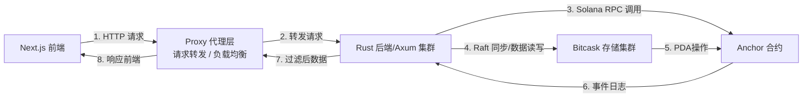

# Aero-KV: Solana 链下可验证键值存储基础设施
> 基于 Solana 合约 + Raft 共识 + Bitcask 持久化的链上链下 KV 存储中间件，提供「链上可信写入 + 链下高性能分页查询」的生产级解决方案，适配 Solana 生态各类 DApp 底层存储需求，突出技术创新性、工程化落地能力与生态赋能价值。

​🌐 **语言**：[English](../README.md) | [简体中文](./docs/README.zh-CN.md)

---

## 🎯 赛事定位
本项目属于 **Solana Web3 基础设施类核心项目**，区别于普通业务 DApp，聚焦 Solana 生态基础设施赛道，核心解决当前生态缺少「链上可验证 + 链下高性能」结构化 KV 存储中间件的行业痛点。项目以「技术创新、工程化落地、生态复用」为核心，打造全栈闭环的生产级存储解决方案，贴合比赛对项目技术深度、落地可行性、生态价值的三大核心评分要求，助力在赛事中突出差异化优势。

---

## ✨ 核心亮点
- 「链上+链下」协同：Solana 合约负责写入校验、事件留痕，链下 Raft 集群+Bitcask 实现高性能持久化与分页查询，兼顾可信性与效率
- 高可用集群：基于 OpenRaft 实现多节点共识，支持数据同步，满足生产级部署需求
- 工程化闭环：内置 Auth/Fee/Counter 全套 PDA 权限体系、系统配置项隔离，开箱即用
- 全栈可交互：Anchor 合约 + Rust 后端（Axum） + Next.js 前端管理面板，完整演示数据流转全流程

---

## 📊 架构总览


核心模块说明：
- 合约层（contract/）：Anchor 开发，负责 KV 写入、事件 emit、权限校验、费用配置
- 后端层（backend/）：Rust + Axum，集成 Bitcask 持久化、Raft 共识、交易广播与日志解析
- 前端层（frontend/）：Next.js 管理面板，提供数据分页展示、交易状态查看
- 代理层（proxy/）：请求转发 / 负载均衡

---

## 🔍 项目创新点
1.  架构创新：打破纯链上存储（租金高、性能差）与纯链下存储（不可信、无审计）的壁垒，采用「链上合约确权 + 链下集群存储」的折中最优方案，是 Solana 生态稀缺的开源可复用存储中间件。
2.  工程创新：同类项目大多仅实现单一模块（纯合约或纯索引），本项目实现「合约+后端+存储+前端」全栈闭环，具备完整的工程化落地能力，可直接演示、直接部署。
3.  细节创新：内置 `sys_*` 系统配置项双层过滤（合约+后端），避免核心配置泄露；集成全套 PDA 权限体系，实现权限校验、费用管控、数据总量同步一体化，体现产品级设计思维。

---

## 🆚 同类项目对比
| 对比维度 | 纯链上 KV Demo 项目 | Helius/The Graph 通用索引服务 | 本项目（Aero-KV） |
| :--- | :--- | :--- | :--- |
| 核心能力 | 仅支持链上 KV 写入，无链下存储、无分页能力 | 仅支持链上数据只读索引，无法实现链上写入与持久化 | 链上写入+链下存储+分页查询，读写一体，支持数据持久化 |
| 性能表现 | 数据量大时易卡顿、崩溃，无高可用能力 | 通用索引适配性差，KV 存储场景效率低 | Bitcask 持久化+Raft 集群，高性能、高可用，支持批量分页 |
| 权限与安全 | 无权限校验，无系统配置隔离，安全性差 | 通用权限设计，不适配 KV 存储场景 | 内置全套 PDA 权限体系，双层过滤系统配置，安全性高 |
| 生态复用性 | 简陋 Demo，无复用价值，无法适配多 DApp | 仅支持只读场景，无法作为底层存储中间件 | 开源可复用，可直接作为各类 Solana DApp 底层存储，支持二次扩展 |

### 对比核心总结
当前 Solana 生态同类项目要么是「纯链上 Demo（无落地能力）」，要么是「只读索引服务（无写入能力）」，要么是「闭源商业服务（无复用价值）」。本项目是 **唯一实现「链上可验证+链下高可用+全栈闭环」的开源 KV 存储基础设施**，差异化优势显著，也是贴合 Colosseum 比赛「创新+落地+生态」核心要求的核心竞争力。

---

## 🛠️ 技术难点与解决方案
1.  难点1：链上事件与链下数据同步一致性  
    解决方案：通过解析合约 `FINAL_TOTAL` 日志同步数据总量，结合 Raft 共识机制，确保多节点数据一致，优化日志解析逻辑，减少同步延迟，保障分页查询准确性。
2.  难点2：系统配置项隔离与安全防护  
    解决方案：在后端分页接口与合约层分别添加过滤逻辑，双重拦截 `sys_paused`、`sys_base_fee` 等系统键，避免核心配置泄露与无关事件广播。
3.  难点3：Raft 集群与 Solana 合约交互适配  
    解决方案：统一封装 Solana 合约交互客户端，让所有 Raft 节点共享同一套交易广播、日志解析逻辑，避免节点同步冲突，确保集群与合约数据实时同步。
4.  难点4：多环境部署兼容性  
    解决方案：优化 Dockerfile 采用最小化镜像，适配不同运行环境；编写完善的 docker-compose 与 K8s 配置，支持本地演示、集群部署，解决 Rust 后端与前端镜像打包兼容问题。

---

## 🌐 生态价值
- 填补空白：解决 Solana 生态缺乏「链上可验证 + 链下高性能」结构化 KV 存储中间件的痛点，完善生态基础设施布局。
- 赋能开发者：可作为各类 Solana DApp（游戏、社交、DeFi 等）的底层存储中间件，开发者无需从零开发存储、索引、分页功能，直接接入即可使用，降低开发成本、提升开发效率。
- 开源复用：项目采用 MIT 开源许可证，模块化设计支持二次扩展，可吸引更多开发者参与迭代，推动 Solana 生态基础设施共同发展。
- 商业潜力：具备完整的权限体系，可直接用于企业级生产环境，为 Web3 企业提供可信、高效、高可用的存储解决方案。

---

## 🚀 快速开始（一键启动全栈）
### 1. 环境准备（必做）
安装项目依赖工具：
```bash
# 安装所有必需的依赖项
curl --proto '=https' --tlsv1.2 -sSfL https://solana-install.solana.workers.dev | bash
```

### 2. 克隆项目并启动
```bash
# 克隆项目（替换为你的仓库地址）
git clone https://github.com/chjgfg/aero-kv.git
cd aero-kv/sh
```
```bash
# 启动
# 1.创建测试钱包
./wallet_start.sh
# 2.开启本地合约环境并部署合约
./conrtact_start.sh 
# 3.开启后端集群
./backend_start.sh 
# 4.开启代理端
./proxy_start.sh 
# 5.开启前端
./frontend_start.sh 
```
```bash
# 停止
# 1.关闭前端
./frontend_stop.sh 
# 2.关闭代理端
./proxy_stop.sh 
# 3.关闭后端集群
./backend_stop.sh 
# 4.关闭本地合约环境并部署合约
./conrtact_stop.sh 
# 5.删除测试钱包
./wallet_stop.sh
```

### 3. 访问与验证
- 前端管理面板：访问 http://localhost:3000，开始使用
- 后端接口测试：访问 http://localhost:80/health，获取集群状态
- 合约部署：若需重新部署合约，执行 cd sh && ./conrtact_stop.sh && ./backend_stop.sh  && ./conrtact_start.sh && ./backend_start.sh 

---

## 📂 项目结构
```text
aero-kv/
├── backend/            # Rust 后端服务
│   ├── src/            # 核心代码（分页接口、Raft、Bitcask、交易处理）
│   └── Cargo.toml      # 后端依赖
├── contract/           # Solana 合约（Anchor）
│   ├── programs/       # 合约核心逻辑（Page 指令、PDA 管理）
│   └── tests/          # 合约测试用例
├── docs/               # 详细文档（中英文双份）
│   ├── zh/             # 中文文档
│   └── en/             # 英文文档
├── frontend/           # Next.js 前端
│   ├── src/            # 页面组件、接口请求
│   └── package.json    # 前端依赖
├── proxy/              # 代理层（请求转发/风控/负载均衡）
├── sh/                 # 自动化部署/启动脚本
├── test_wallets/       # 测试钱包配置
├── .gitignore
└── README.md           # 项目主文档
```

---

## 📚 详细文档（按需查看）
- [部署指南](./zh/1.deployment.md)：本地开发、部署（含脚本使用说明）
- [合约说明](./zh/2.contract.md)：PDA 账户结构、Page 指令、事件解析、权限控制细节
- [常见问题](./zh/3.faq.md)：部署报错、数据不一致、合约事件异常等问题排查

---
## 📊 Code Statistics / 代码统计
| Language | Files | Lines | Code | Comments | Blanks |
| :--- | :--- | :--- | :--- | :--- | :--- |
| CSS | 1 | 26 | 22 | 0 | 4 |
| JavaScript | 2 | 25 | 20 | 2 | 3 |
| JSON | 5 | 9933 | 9933 | 0 | 0 |
| Shell | 10 | 365 | 237 | 62 | 66 |
| SVG | 5 | 5 | 5 | 0 | 0 |
| TOML | 6 | 138 | 100 | 15 | 23 |
| TSX | 8 | 1076 | 950 | 30 | 96 |
| TypeScript | 8 | 1399 | 1101 | 169 | 129 |
| Markdown | 3 | 129 | 0 | 95 | 34 |
| **Rust** | **59** | **5213** | **3875** | **785** | **553** |
| **Total** | **107** | **18413** | **16302** | **1188** | **923** |

---

## 🔧 技术栈
- 合约：Solana、Anchor、Rust
- 后端：Rust、Axum、Bitcask、OpenRaft、Solana Rust SDK
- 前端：Next.js、TypeScript、React
- 代理：Rust、Axum

---
